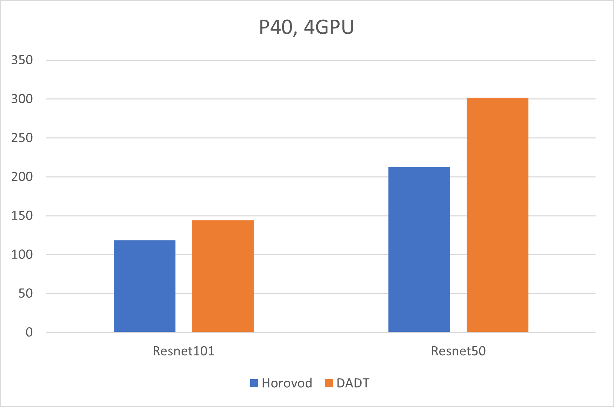

# DADT
DADT is A Decentrilized Asynchronously Distributed Training framework for Pytorh. DADT use asynchronously AllReduce algorithm to exchange gradients. So it has AllReduce and Asynchronous's advantage at the same time. Refer to 3 paper: [Pipe-SGD: A Decentralized Pipelined SGD Framework for Distributed Deep Net Training](https://arxiv.org/abs/1811.03619), [Asynchronous Decentralized Parallel Stochastic Gradient Descent](https://arxiv.org/abs/1710.06952) and [EXASCALE DEEP LEARNING FOR SCIENTIFIC INVERSE PROBLEMS](https://arxiv.org/pdf/1909.11150.pdf).

# Perf Compare
Perf test compare with Horvod, using Resnet101/Resnet50.

|                       | Horovod Throughtput | DADT Throughput | Increase  |
| ----                  | ----                | ----            | ----      |
| Resnet101, P40, 4GPU  | 213                 | 301.8           | **41.6%** |
| Resnet50, P40, 4GPU   | 118.5               | 144             | **21.5%** |




# Install
DADT run on Linux platform.

- step 1: install [CUDA](https://docs.nvidia.com/cuda/cuda-installation-guide-linux/index.html) and [NCCL](https://docs.nvidia.com/deeplearning/sdk/nccl-install-guide/index.html).
- step 1: install Pytorh.
- step 2: install MPI, [OpenMPI](https://www.open-mpi.org/) or [Intel MPI](https://software.intel.com/en-us/mpi-library) etc.
- step 3: clone the project. open file ```setup.py``` change ```build_for_nccl``` to be ```True``` if want build for GPU. use below command to build and install DADT.
```shell
# set be True for build for GPU
build_for_nccl=True/False

# install command
python setup.py install
```

# How to use
DADT depend on Pytorh, it must embeded in Pytorh code. below is a mnist example.
```python
# import
import dadt.Pytorh as dadt

  .
  .
  .

def main(unused_argv):
  # at beginning init DADT
  # cycle_duration_ms: background thread do AllReduce periodically, cycle_duration_ms control how many time between every step.
  # broad_cast_executor: broadcast executor, at beginning rank-0 will broadcast weight to other ranks. use broad_cast_executor to decide which broadcast executor will be used. 
  # 'mpi': use MPI do broadcast
  # 'nccl': use CUDA NCCL do broadcast
  # 'mpicuda': use MPI to do broadcast and MPI must be [GPU-aware](https://devblogs.nvidia.com/introduction-cuda-aware-mpi/). 
  # When traing on CPU must choose 'MPI'.
  # all_reduce_executor: same like broad_cast_executor this flag decide whick executor use to do AllReduce.
  # all_reduce_buffer_size: AllReduce fusion buffer, default is 64MB, set to be 0 means do not use buffer.
  # group_buffer_size: used to collect ioslate tensor to a Group.
  dadt.init(cycle_duration_ms=3, 
            broad_cast_executor='nccl', 
            all_reduce_executor='mpi',
            all_reduce_buffer_size=67108864,
            group_buffer_size=67108864)
  .
  .
  .
  # wrapper the optimizer
  optimizer = optim.Adadelta(model.parameters(), lr=args.lr)
  distribte_optimizer = dadt.DistributedOptimizer(optimizer=optimizer)
  .
  .
  .
  # tain like nornaml pytorch
  distribte_optimizer.zero_grad()
  .
  .
  .
  loss.backward()
  distribte_optimizer.step()
```
below is run command using MPI, it will create 2 rank in same machine for training.
```shell
mpirun -np 2 python mnist.py
```